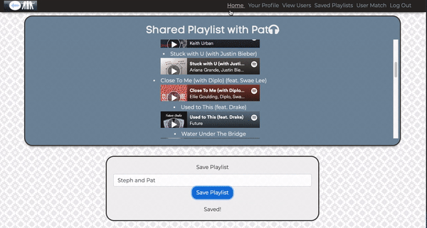
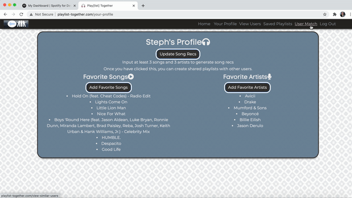
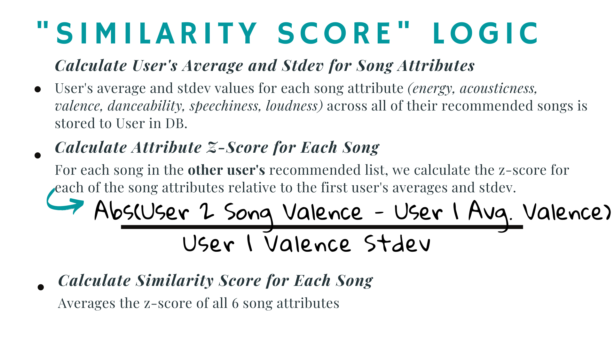

Play[list] Together is a single-page web app built in React that enables 2 users to generate a playlist that considers each of their music preferences in identifying songs that will appeal to both users. The inspiration for this project stems from my experiences making shared playlists with a friend -- while we could each add songs that we liked to the playlist, we didn’t always like the songs that the other person put on the playlist. Play[list] Together solves this by using song attribute data from the Spotify API to identify songs that both users are likely to enjoy. 

## Deployment
[Playlist-Together.com](http://playlist-together.com/)

## Demo Video
[Link](https://www.youtube.com/watch?v=Ua2aOYD788Q)

## Examples
- Adding artist preferences and generating a shared playlist

- Viewing User Match

## Technology Stack
- Python
- Javascript
- Flask
- SQLAlchemy
- PostgreSQL
- React
- React-Bootstrap
- React-Router
- HTML
- CSS
- Chart.js
- Spotify API

## Features
- Users can add their favorite songs and favorite artists to their profile.
    - Autocomplete functionality makes suggestions as the user types a song or artist
- Users generate song recommendations based on the songs and artists that they have saved to their profile
- Ability to view all users' profiles and see their music preferences
    - Ability to generate a shared playlist with each user and saved shared playlist to profile
- Spotify widgets enable playback of the songs in the playlist
- "User Match" feature enables users to view the user in the database whose music taste is most similar to theirs
    - Users can view a radar graph plotting their song attribute averages compared to their match's attribute averages

## Similarity Score Logic
Playlists are generated for both users based on the "similarity score" of songs. Songs on one user's recommended songs list that are most similar to the preferences of the other user are selected for the playlist.

## About the Engineer
Prior to attending Hackbright Academy's full-stack software engineering fellowship, Stephanie worked in finance, with roles in tech corporate finance and real estate private equity. Stephanie's interest in computer science was initially sparked during her last semester at the University of Michigan. Stephanie had completed an finance internship at Intel the previous summer and had accepted her offer to work as a finance analyst at Intel upon graduating. Stephanie decided to take a computer science class to enhance her knowledge prior to working full-time at a tech company. The CS class really "clicked" with Stephanie and it ended up being her favorite class of college. While working in finance for the past 5 years, the aspect of her job that she enjoyed most was building out the logic of financial models. When COVID-19 started, she had more free time to explore programming classes online. This helped her to re-realize her passion for computer science  -- particularly building things and using logic to solve problems. Stephanie is excited to continue building software and growing her knowledge as a software engineer.